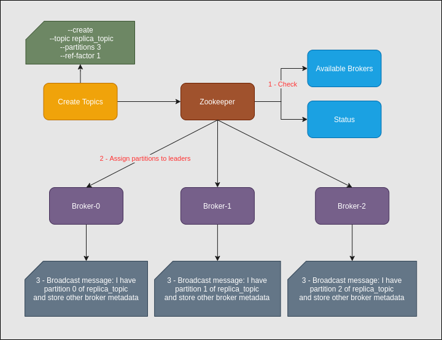
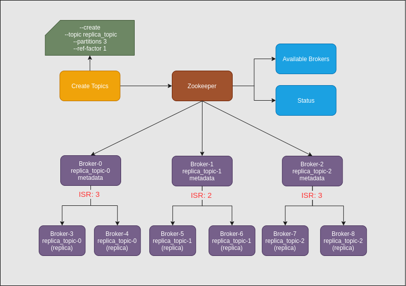

# Part 2 - Kafka Partitions

This section shows how partitions are managed for topics, producer,
consumer and with replication.

## Create Kafka Topic

## Kafka Partitions Producer

## Kafka Partitions Consumer

## Kafka Partitions with Replication

## Series
- [Part 1 - Kafka Key Terminology](kafka-key-terms.md)
- [Part 3 - Run a single instance of Apache Kafka](kafka-single-instance.md)
- [Part 4 - Run a multiple instances of Apache Kafka](kafka-multiple-instance.md)
- [Part 5 - Kafka Producer](kafka-producer.md)
- [Part 6 - Kafka Consumer](kafka-consumer.md)
